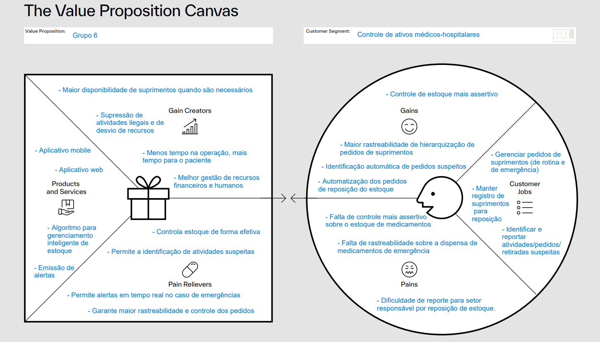

# Canvas Proposta de Valor

A proposta de valor é um conceito fundamental no desenvolvimento de produtos ou serviços, pois descreve a promessa de valor que uma empresa faz aos seus clientes. Essa promessa destaca os benefícios únicos e significativos que os clientes podem esperar ao adquirir e usar o produto ou serviço. Em essência, a proposta de valor responde à pergunta: "Por que os clientes devem escolher nossa oferta em vez das alternativas disponíveis no mercado?". Ela engloba elementos como os benefícios oferecidos, os problemas que o produto ou serviço resolve, os diferenciais em relação à concorrência e o valor percebido pelo cliente ao utilizar a oferta. Uma proposta de valor bem definida e comunicada é essencial para atrair e reter clientes, destacando as vantagens competitivas e criando conexões emocionais e funcionais que impulsionam o sucesso do negócio. Abaixo, está a análise feita levando em consideração as duas visitas da parceira de mercado.

Descrição dos itens: A proposta de valor com criadores de ganho se refere à capacidade de um produto ou serviço oferecer benefícios tangíveis e mensuráveis aos clientes, seja aumentando sua receita, reduzindo custos operacionais ou melhorando sua eficiência. Produtos ou serviços que funcionam como analgésicos são aqueles que resolvem problemas urgentes ou críticos para os clientes, enquanto os persis do cliente com ganhos estão relacionados aos benefícios de longo prazo que eles obtêm ao utilizar o produto ou serviço. Os trabalhos do cliente representam as tarefas que eles precisam realizar e as dores são os desafios ou dificuldades que enfrentam ao tentar realizar esses trabalhos. Juntos, esses elementos compõem uma proposta de valor abrangente e eficaz que visa atender às necessidades e expectativas dos clientes de forma significativa.
