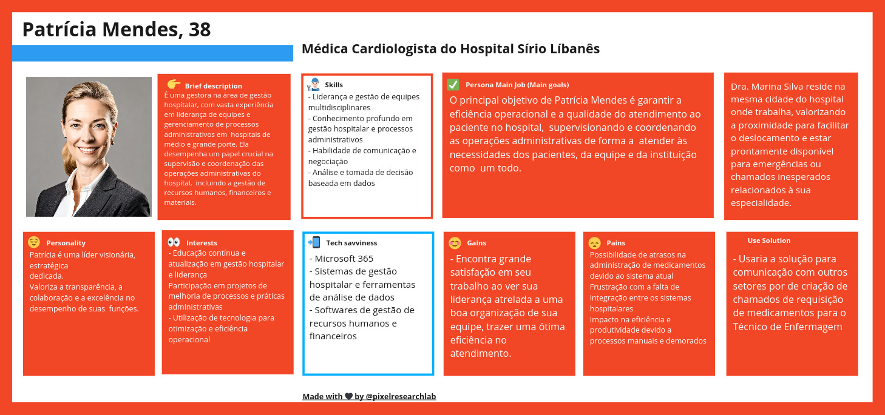

# Refatoração Personas e User Stories

Mediante ao feedback do cliente, a nossa persona da Médica foi atualizada para Gestão Hospitalar.

O principal motivo para a alteração foi devido que a persona Médica, para o cliente, não fazia sentido e que não complementava para o projeto. A criação da Persona Gestão Hospitalar é focada em um acesso de administrador da plataforma, fazendo assim, mais coerência para com a expectativa para o nosso stakeholders. Logo, a atualização do desenvolvimento segue a baixo:

## Persona: Gestão Hospitalar Patrícia Mendes

### Breve Descrição

É uma gestora na área de gestão hospitalar, com vasta experiência em liderança de equipes e gerenciamento de processos administrativos em  hospitais de médio e grande porte. Ela desempenha um papel crucial na  supervisão e coordenação das operações administrativas do hospital,  incluindo a gestão de recursos humanos, financeiros e materiais.

### Skills

- Liderança e gestão de equipes multidisciplinares
- Conhecimento profundo em gestão hospitalar e processos administrativos
- Habilidade de comunicação e negociação
- Análise e tomada de decisão baseada em dados

### Seu objetivo

O principal objetivo de Patrícia Mendes é garantir a eficiência operacional e a qualidade do atendimento ao paciente no hospital,  supervisionando e coordenando as operações administrativas de forma a  atender às necessidades dos pacientes, da equipe e da instituição como  um todo.

### Personalidade

- Visionária
- Estratégica
- Dedicada
- Valoriza a transparência, a colaboração e a excelência no desempenho de suas funções.

### Interesses

- Educação contínua e atualização em gestão hospitalar e liderança
- Participação em projetos de melhoria de processos e práticas administrativas
- Utilização de tecnologia para otimização e eficiência operacional

### Conhecimentos Tecnológicos

- Microsoft 365
- Sistemas de gestão hospitalar e ferramentas de análise de dados
- Softwares de gestão de recursos humanos e financeiros

### Seus Ganhos

- Encontra grande satisfação em seu trabalho ao ver sua liderança atrelada a uma boa organização de sua equipe, trazer uma ótima eficiência no atendimento.

### Suas Dores

Possibilidade de atrasos na administração de medicamentos devido ao sistema atual
Frustração com a falta de integração entre os sistemas hospitalares
Impacto na eficiência e produtividade devido a processos manuais e demorados.

### Rotina

Reside na mesma cidade do hospital onde trabalha, valorizando a proximidade para facilitar o deslocamento. Sempre utiliza o seu próprio meio de locomoção.

### Uso da Solução

- Usaria a solução para comunicação com outros setores, analisaria o desempenho das equipes e tambem o número de requisições geradas.

## User Storie

1. Como gestora, desejo uma integração perfeita entre os sistemas hospitalares para evitar atrasos nos processos administrativos e garantir uma gestão eficiente dos recursos hospitalares, incluindo estoque de medicamentos, equipamentos médicos e recursos humanos, para melhor atender às necessidades dos pacientes e da equipe médica.

2. Como gestora quero implementar tecnologias de gestão hospitalar especializadas para otimizar processos e aumentar a eficiência operacional do hospital, permitindo uma alocação mais eficaz de recursos e uma redução nos custos administrativos, enquanto mantemos altos padrões de qualidade no atendimento ao paciente.

3. Como gestora preciso de sistemas de comunicação que gere informações (dashboard) como número de tickets gerados, tempo para finalização, quantos estão ainda em aberto, etc, para metrificar o desempenho das minhas equipes.

4. Como gestora desejo um sistema de gestão de medicamentos que garanta o controle preciso do estoque, a distribuição eficiente dos medicamentos e o monitoramento rigoroso dos padrões de segurança e qualidade, reduzindo assim os riscos de desvio, desabastecimento ou uso inadequado de medicamentos no hospital, para garantir o fornecimento adequado e oportuno dos medicamentos necessários para o tratamento dos pacientes.

# Desenvolvimento

O desenvolvimento da Persona foi feito na plataforma Miro. Para consultar todas com maior nível de detalhes, segue o Link abaixo:

https://miro.com/app/board/uXjVKSJ_Dr0=/?share_link_id=442148356505
