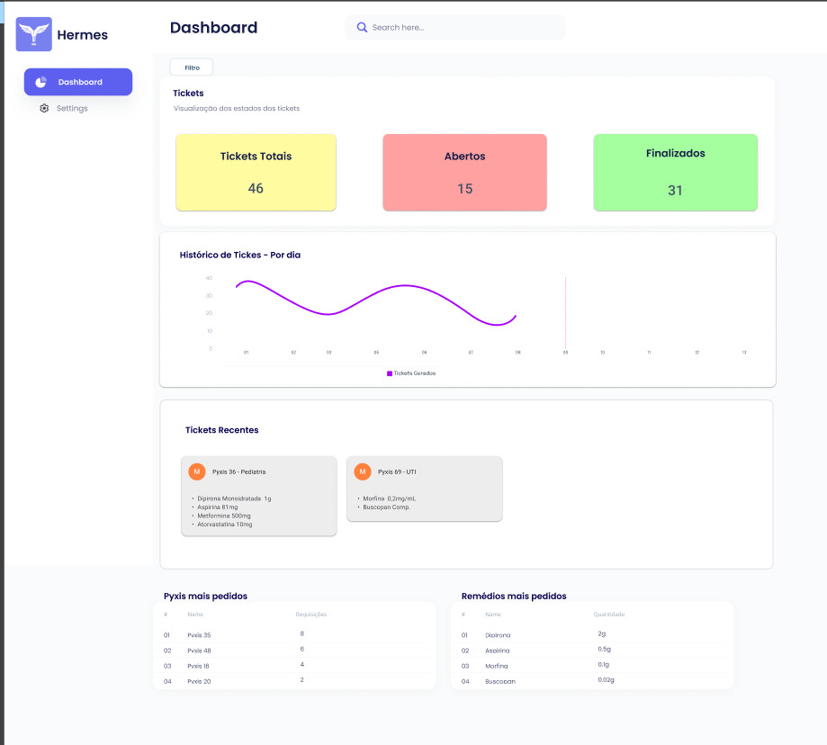
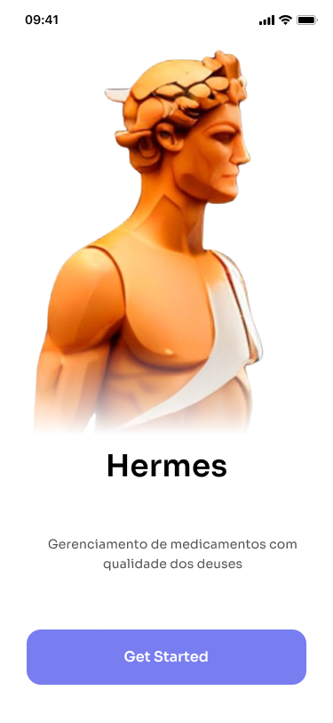
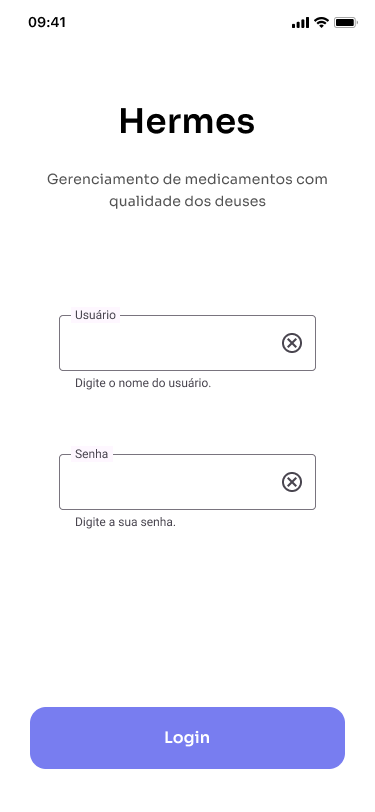
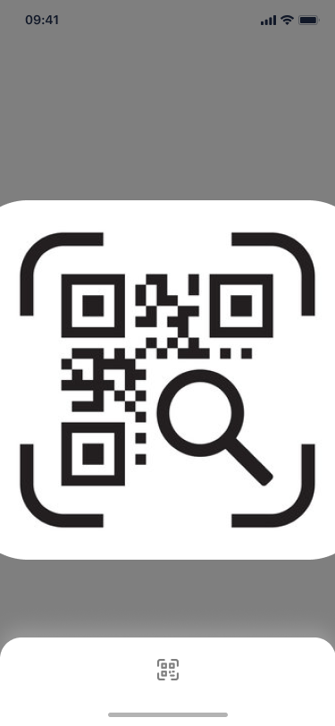

# Protótipo e Wireframe

A prototipação desempenha um papel crucial no desenvolvimento de qualquer produto digital. Ela permite que designers e desenvolvedores visualizem e testem ideias antes de investir tempo e recursos significativos na implementação completa.

## Dashboard

A tela do Dashboard foi pensanda para a persona gestora do hospital. Nela é possível supervisionar os tickets que foram abertos e seus status, além de receber insights, como gráficos e listas que possibitam a análise de dados.

## Login (v.Mobile)

A tela de login, na versão mobile, foi pensada para as personas farmacêuticas e técnicas. Nela, o usuário já cadastrado no sistema do Hospital Sírio Libanês poderá entrar no aplicativo com suas credênciais e ter acesso às funcionalidades ao qual seu cargo o permite.

## Criação de Tickets

A tela de criação de tickets foi pensada para as personas farmacêuticas. Nela, o usuário já logado no sistema do Hospital Sírio Libanês poderá abrir um ticket requisitando itens após a indentificação do pyxis via QrCode.

## Recebimento e Encerramento de Tickets

A tela de recebimento e encerramento de tickets foi pensada para as personas técnicas. Nela, o usuário já logado no sistema do Hospital Sírio Libanês receberá um ticket. Após o técnico concluir a solicitação, ele poderá encerrar o ticket.

.png)

.png)

## Recebimento e Encerramento de Tickets

A versão mais recente do wireframe pode ser encontrada [aqui](https://www.figma.com/design/QSBEjKjJzSQm3ex2ibWwJQ/Wireframe?node-id=0-1&t=FqdeAhVok22xEic8-1).
