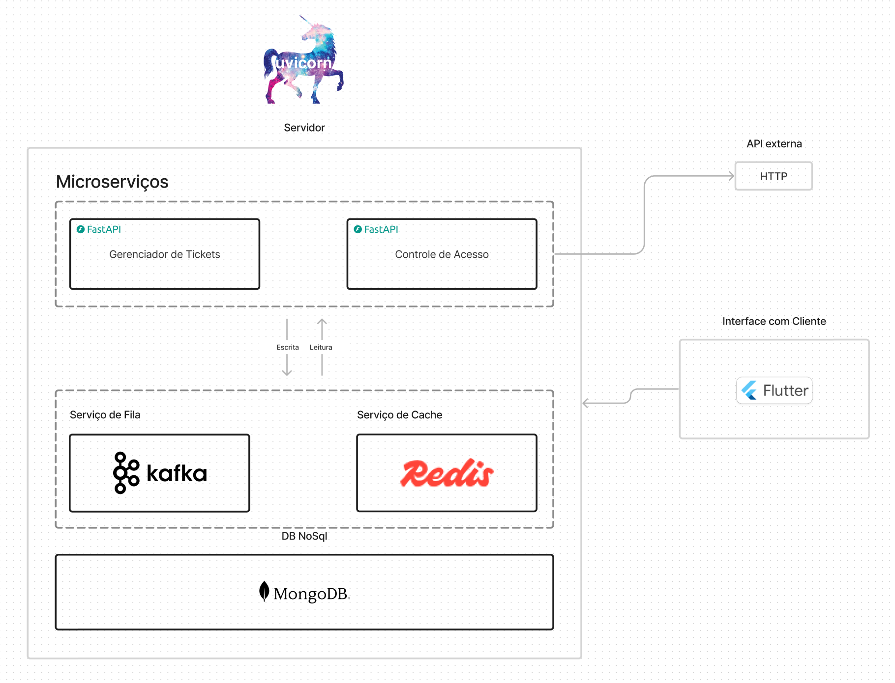

# Arquitetura do Backend - Versão 3

## Introdução

Este documento descreve a arquitetura do backend para o aplicativo de solicitação de medicamentos em hospitais. A arquitetura foi projetada para fornecer uma solução escalável, segura e eficiente para atender às necessidades dos usuários e do hospital. A versão 2 da arquitetura do backend inclui atualizações e melhorias com base no feedback recebido e nas necessidades identificadas durante a implementação.

## Arquitetura

### Overview

A arquitetura do backend é composta por vários componentes que trabalham juntos para fornecer funcionalidades essenciais para o aplicativo. Os principais componentes incluem:
Uma api de autenticação que gerencia a autenticação e autorização dos usuários. Uma api de tickets de reposição de
medicamentos que gerencia a criação, atualização e exclusão de tickets de reposição de medicamentos. Isso inclui a validação de dados, a comunicação com o banco de dados e a notificação de usuários sobre o status do ticket. Uma fila de mensagens no kafka  para permitir a comunicação assíncrona entre os diferentes componentes do sistema. Isso inclui a comunicação entre a api de tickets e o banco de dados evitando sobrecarga no banco de dados. Um banco de dados não relacional para armazenar dados relacionados a usuários, tickets de reposição de medicamentos e outras informações relevantes.

#### Decisões tecnológicas

1. **Arquitetura Microserviços**:
   - Foi escolhida uma arquitetura de microserviços para permitir a escalabilidade e a manutenção de componentes independentes.
   - A separação da api de autenticação e da api de tickets segue os princípios do oauth2
   - A futura implmentação de um gateway de api permitirá a comunicação entre os diferentes microserviços de forma segura e eficiente.

2. **Kafka Queue**:
   - A fila de mensagens do Kafka foi escolhida para permitir a comunicação assíncrona entre os diferentes componentes do sistema e evitar deadlocks e sobrecarga no banco de dados.
   - Decidimos usar o kakfa em vez do RabbitMQ devido a sua escalabilidade e tolerância a falhas. Além disso o kafka possui imagem aberta com ampla documentação da comunidade.
   - A impllentação da fila atraves da sua imagem no docker permite termos total controle sobre a escalibilidade do sistema.

3. **Redis**:
   - O Redis foi escolhido para armazenar dados em cache e melhorar o desempenho do sistema em informações que são acessadas com frequência.
   - Visamos em futuras implementações utilizar memory cache para substituir o redis
   - A implementação atual do redis é parcial e futuras implementações devem incluir a utilização de um banco de dados em memória.

4. **Mongodb**:
   - Utilizamos um cluster de mongo do atlas db para termos um banco de dados não relacional escalável e seguro.
   - A utilização de um banco de dados não relacional permite uma maior flexibilidade na modelagem dos dados e escalabilidade do sistema.
